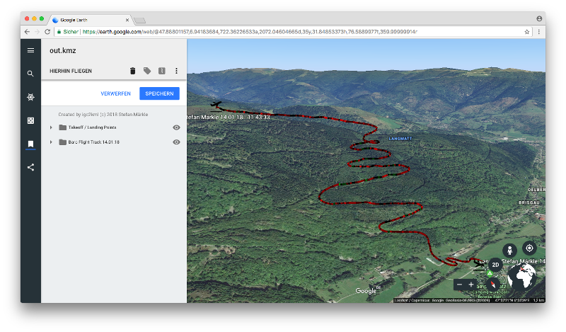

# IGC2KML
(c) 2018 by Stefan Märkle <stefan@maerkle.de>

## Introduction
I wanted to view the climbrates of my paragliding flights in google earth but found no software that was able to color-code this into a google earth file. So i wrote the software myself.

## Build

'mvn clean package' builds a jar file that can be executed 

## Execute

java -jar igc2kml-1.0-SNAPSHOT-jar-with-dependencies.jar myinputfile.igc myoutputfile.kmz

This reads in myinputfile.igc in igc format and builds an output file myoutputfile.kmz in kmz format suitable for google earth.

## Logic

- All times are UTC, nothing converted.
- All altitudes are in meters, nothing converted.

### Altitude logic
- Altitude info is taken from barometric pressure but corrected with the help of the gps altitude.
- Barometric altitude can differ significantly from Gps altitude due to weather changes (even during the flight, e.g. for long xc flights) 
- Barometric altitude has a finer resolution than Gps altitude.
- Thus I take the barometric altitude for display but do a correction
- The correction is a linear interpolation of the difference between GPS and barometric altitude at takeoff and at landing.

## Copyrights & Disclaimer
- The software is (c) by Stefan Märkle
- Starting and landing icons are (C) from Becris https://www.shareicon.net/search?c=becris under Creative Commons Attribution 3.0 license.
- The software is provided 'as-is'. I do not hold liable for anything you do with it.